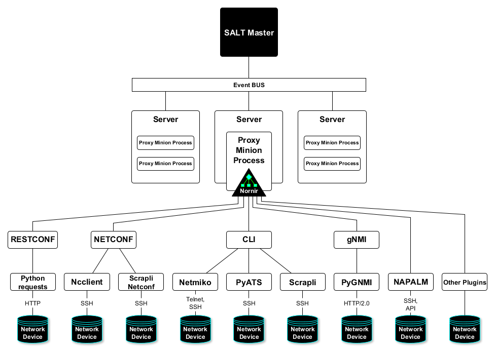

Overview
########

Nornir Proxy Minion is a collection of SaltStack modules and Nornir Plugins to
interact with network devices using SaltStack command line interface utilities
and Python API.

Why Salt-Nornir?
================

**First of all, scaling**

Salt Nornir modules help to address scaling issues of interacting with devices at high numbers
(hundreds to tens of thousands) effectively using resources (accomplish more with less), but
without sacrificing execution speed.

To demonstrate, for each network device to manage with SALT, normally there is a
dedicated proxy-minion process configured and started. Each process consumes about
100 MByte of RAM providing in return capability to manage single network device.

.. image:: ./_images/overview_usual_proxy-minion_architecture.png

With nornir-proxy, while each proxy-minion process might consume more RAM, Nornir Proxy minion
capable of managing multiple network devices using Nornir plugins.

.. image:: ./_images/overview_nornir_proxy-minion_architecture.png

As a result, the more devices single Nornir proxy minion manage, the less overall resources
used compared to normal proxy minion. However, the more devices, the longer it usually takes
to execute tasks - at one extreme, single Nornir proxy can manage one device only, giving the
fastest execution time, on the other hand, Nornir proxy minion can  run tasks against 1000
devices, crawling them over several minutes.

Optimal number of devices managed by single Nornir proxy depends on the environment it operates in
and should be decided on a case by case basis. Each connection to device requires resources to operate,
usually around 2-3MByte of RAM per device, but might vary depending on the environment and plugins in use.

**Secondly, extendability and pluggability**

Nornir is Python, SALT is Python, Nornir is pluggable framework, SALT is pluggable
framework, Nornir is open-source, SALT has open-source community version - sounds like a nice fit
and it really is.

Given that both frameworks can expose themselves using Python and support modules/plugins,
extendability is endless. Several examples:

(1) Conventional Proxy Minion locked in a certain way of interacting with network
devices, normally using single library of choice. Nornir, on the other hand, handles interactions
via plugins. As a result same Nornir Proxy minion can use several plugins to interact with devices.
As of now Norir Proxy Minion supports NAPALAM, Netmiko, Scrapli, Scrapli Netconf, Ncclient, PyGNMI
and Python requests in addition to any other plugins that Nornir.

(2) SaltStack has CLI utilities, schedulers, returners, REST API, pillar, beacons, event bus, mine,
templating engines systems and many other pluggable systems. All of them available for use with
Nornir Proxy Minion.

How it fits together
====================

`SaltStack <https://docs.saltproject.io/en/latest/>`_ software,
`Nornir <https://nornir.readthedocs.io/en/latest/>`_ framework,
`nornir_salt <https://nornir-salt.readthedocs.io/en/latest/>`_ and salt_nornir packages - how it fits together?

.. code-block::

    We can solve any problem by introducing an extra level of indirection.

        David J. Wheeler

    …except for the problem of too many levels of indirection

From more specific to more abstract:

**nornir_salt** - is a collection of Nornir plugins, born in the process of creating
Nornir Proxy Minion

**Nornir** - pluggable automation framework to interact with network devices using pure Python

**salt_nornir** - collection of SaltStack modules that use Nornir to manage network devices

**SaltStack** - Python-based, open-source software for event-driven IT automation, remote
task execution and configuration management (Wikipedia)

.. image:: ./_images/how_it_fits.png

How it works
============

Wrapping Nornir in Salt Proxy Minion allows to run jobs against multiple endpoints. As a result, single
proxy process can deliver configuration or retrieve state from multiple devices using various
connection methods.

Nornir Proxy supports devices' long running connections and shares access to devices with child
processes. To facilitate efficient use of connection resources, proxy-minion designed to use queues for
inter-process jobs communication.

This architecture helps avoid these problems:

* If no long running connections exists to devices, each new task creates dedicated connections to devices, increasing overall execution time
* Increase in the number of connections increases load on AAA system (Tacacs, Radius) as more tasks result in more authentication requests from devices

.. image:: ./_images/nornir_proxy_inter_process_communication_v0.png

Above architecture prone to these **drawbacks**:

* Double targeting required to narrow down tasks execution to a subset of hosts
* In addition to knowing how pillar works, one will have to know how `Nornir inventory <https://nornir.readthedocs.io/en/3.0.0/tutorial/inventory.html>`_ structured to use
  it effectively, as Nornir inventory integrated in proxy-minion pillar
* Tasks executed sequentially one after another, if a lot of tasks scheduled simultaneously, they will consume resource waiting to execute

To address double targeting, Nornir filtering capabilities utilized using additional filtering functions, reference nornir-salt module
`FFun function <https://nornir-salt.readthedocs.io/en/latest/Functions/FFun.html>`_ for more information. But in short,
have to use ``Fx`` parameters to filter hosts, for example::

    # target only IOL1 and IOL2 hosts:
    salt nrp1 nr.cli "show clock" FB="IOL[12]"

Nornir process watchdog or known issues
=======================================

Slowly crashlooping system is usually preferable to a system that simply stops working.

To address various issues that can happen during lifespan of Nornir Proxy minion process
each such a process has watchdog thread running. Watchdog constantly execute checks
on a predefined intervals controlled by ``watchdog_interval`` parameter (default 30s).

Problems watchdog should be capable of handling:

1. **Memory overconsumption**. ``memory_threshold_mbyte`` and ``memory_threshold_action``
proxy minion settings can help to prevent proxy minion process from running out of memory.
Normally, because Nornir Proxy minion uses multiprocessing to run tasks instead of
threading it is not prone to memory leak issues, however, having
capability to log or restart process in response to consuming too much memory can
be helpful in extreme cases like bugs in new software releases.

2. **Stale child processes**. During nornir proxy minion testing was detected that some
child processes started to execute tasks might stuck for unknown reason. Probably
bug of some sort. That usually leads to child process running indefinitely, consuming
system resources and task never been completed. To mitigate that problem, watchdog
runs lifespan detection for all child process by measuring their age, if age
grows beyond ``child_process_max_age`` parameter (default 660s), watchdog kills such
a process.

3. **Stale connections to devices**. Sometime connections to devices might become unusable.
For instance device rebooted or network connectivity issue. Nornir plugins usually not
capable of recovering from such a problems, as a result watchdog runs connection checks to
confirm they are alive, clearing them otherwise.

3.1. **Connections keepalives**. Common connections liveness detection mechanism usually
requires sending some data down the connection channel, receiving some data from device
in response. Because of that, connections effectively kept alive, preventing them from
timing out on device end due to inactivity.

4. **Running out of file descriptors (fd) problem**. On Unix systems each process can have
limited number of file descriptors created, usually around 1000, because Nornir proxy
minion uses multiprocessing queues for inter-process communications, effectively creating
pipes on a lower level, each such a pipe consume file descriptor. But after child
processes destroyed, not all fds deleted for some reason, fd leaking after reaching OS limit
prevents proxy minion process from running tasks. Watchdog on each run creates and destroys
test pipes, restarting Nornir proxy minion process on failure to do so. Nornir proxy minion
process restart leads to clearing of all previously created pipes and release of file descriptors.
Future Nornir proxy releases might include a fix for this problem, but other reasons might
lead to fd leaks, having mechanism in place to detect and recover from such a problem could
be of great benefit regardless.

5. **Worker thread stops for some reason**. Some tasks might lead to worker thread exit on error,
that wold stop execution of further submitted tasks. To solve that problem watchdog thread calls
worker thread's ``is_alive`` method verify its status, restarting it if it stopped.
