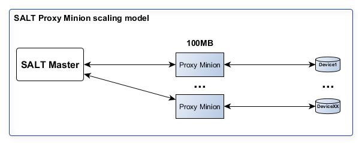
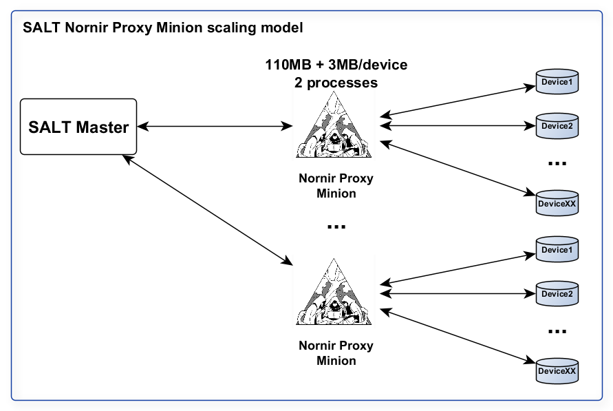

Overview
########

**Why use Nornir with SALT?**

**First of all**, Salt Nornir modules help to address scaling issues of interacting with
devices at high numbers - hundreds to tens of thousands - without over consuming 
resources, accomplish more with less.

To demonstrate, normally for each network device to manage with SALT, there is a 
dedicated proxy-minion process must be configured and started together with additional 
(watchdog) process to manage it. Each pair of processes consumes about 110 MByte (numbers 
might differ depending on environment and serve as example only) providing in return 
capability to interact with a single device.

With Nornir-proxy, while each proxy-minion consumes same amount of RAM and also requires 
2 processes to operate, Nornir Proxy minion capable of managing multiple network devices.

As a result, the more devices single Nornir proxy minion manages, the less overall resources 
used. However, the more devices, the longer it usually takes to execute tasks - time vs
resources problem - at one extreme, single Nornir proxy can manage one device only, giving the 
fastest task execution time, on the other end, Nornir proxy minion can run task against 1000 
devices, crawling them over several minutes. 

Optimal number of devices managed by single Nornir proxy depends on the environment it operates in
and should be decided on a case by case basis.

**Secondly**, Nornir is Python, SALT is Python, Nornir is pluggable framework, SALT is pluggable 
framework, Nornir is open-source, SALT has open-source community version - sounds like a nice fit 
and it really is. 

Why? Couple examples.

(1) Conventional Proxy Minion locked in certain way of interacting with network 
devices, normally using library of choice. Nornir, on the other hand, handles interactions 
via plugins, meaning, same Nornir Proxy minion can use various means to interact with devices. 
For instance, support coded for popular open-source libraries such as Netmiko, NAPALM 
and Scrapli. New Nornir plugins (e.g. task and connection plugins) should be supported by 
Nornir Proxy minion as well

(2) SALT has schedulers, returners, REST API, pillar, beacon, event bus, mine, templating etc. systems,
all of them available for use with Nornir Proxy Minion, allowing to save significant amount of time 
on addressing various use cases that otherwise would turn in tangible coding exercise. New SALT modules 
and capabilities should interoperate with Nornir proxy minion seamlessly.
