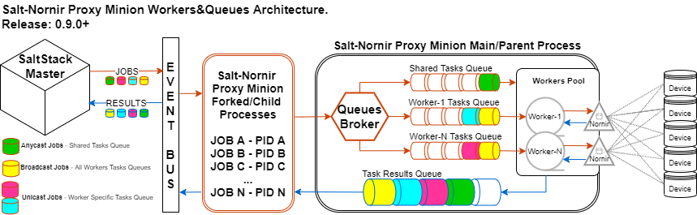

Overview
########

Salt-Nornir is a `SaltStack Proxy Minion <https://saltproject.io/>`_ built for 
Network Automation using `Nornir framework <https://nornir.readthedocs.io/>`_.

.. image:: ./_images/Nornir_proxy_minion_architecture_v2.png

Why Salt-Nornir?
================

**SCALING**

Salt-Nornir helps to address scaling issues of interacting with devices at high numbers, 
efficiently using resources without sacrificing execution speed.

Normally, for each network device dedicated proxy-minion process configured 
and once started, each consuming about 100 MByte of RAM.

Contrary, single instance of Salt-Nornir Nornir Proxy Minion capable of managing multiple 
network devices using Nornir.

As a result, the more devices single Salt-Nornir Proxy Minion manages, the more system 
resources saved.

At one extreme, single Salt-Nornir proxy can manage one device only, giving the fastest 
execution time but consuming the most of resources. 

At another extreme, Salt-Nornir proxy minion can manage 1000 devices, slowly crawling 
them over time but saving on resource usage.

Optimal number of devices managed by Salt-Nornir proxy depends on the environment it operates
in and decided on a case by case basis.

**EXTENDABILITY**

Nornir and SALT both use Python, both are pluggable frameworks and both open-source.

Given that both frameworks has Python API and native support for modules/plugins, extendability 
is endless. 

Examples:

(1) Usually Proxy Minion locked in a certain way of interacting with network devices using 
single library of choice. Salt-Nornir, on the other hand, handles interactions using plugins. 

As a result, same Salt-Nornir Proxy Minion can manage network devices using several libraries.
Out of the box Salt-Nornir Proxy Minion comes with support for NAPALAM, Netmiko, Scrapli, Scrapli 
Netconf, Ncclient, PyGNMI, PyATS and requests libraries to interact with network infrastructure.

(2) SaltStack has CLI utilities, schedulers, returners, REST API, pillar, beacons, event bus, mine,
templating engines and many other pluggable systems. All of them available for use with Salt-Nornir 
Proxy Minion.

(3) In case none of the existing plugins suite the use case, Nornir Tasks plugins together with 
SaltStack Python API systems can be used to address the problem. 

How it fits together
====================

`SaltStack <https://docs.saltproject.io/en/latest/>`_ software,
`Nornir <https://nornir.readthedocs.io/en/latest/>`_ framework,
`nornir_salt <https://nornir-salt.readthedocs.io/en/latest/>`_ and salt_nornir packages - how it fits together?

.. code-block::

    We can solve any problem by introducing an extra level of indirection.

        David J. Wheeler

    …except for the problem of too many levels of indirection

From more specific to more abstract:

**nornir_salt** - is a collection of Nornir plugins, born in the process of creating
Nornir Proxy Minion

**Nornir** - pluggable automation framework to interact with network devices using pure Python

**salt_nornir** - collection of SaltStack modules that use Nornir to manage network devices

**SaltStack** - Python-based, open-source software for event-driven IT automation, remote
task execution and configuration management (Wikipedia)

.. image:: ./_images/how_it_fits.png

How it works
============

Wrapping Nornir in Salt Proxy Minion allows to run jobs against multiple devices. Single proxy 
process can apply configuration or retrieve devices' state using Nornir plugins.

Salt-Nornir Proxy Minion controls and enables shared access to network devices resources using
queues for child and main processes communication.

Above architecture assumes:

* Double targeting required to narrow down tasks execution to a subset of hosts
* In addition to knowing how pillar works, one need to know how `Nornir inventory <https://nornir.readthedocs.io/en/3.0.0/tutorial/inventory.html>`_ 
  structured, as Nornir inventory integrated with proxy-minion pillar

To address double targeting, Salt-Nornir comes with filtering functions, refer to Nornir-Salt
`FFun functions <https://nornir-salt.readthedocs.io/en/latest/Functions/FFun.html>`_ for details. 
Filter functions use ``Fx`` Salt CLI arguments to filter hosts. 

For example::

    # target only IOL1 and IOL2 hosts:
    salt nrp1 nr.cli "show clock" FB="IOL[12]"

Nornir process watchdog or known issues
=======================================

Slowly crashlooping system is usually preferable to a system that simply stops working.

To address various issues that can happen during lifespan of Nornir Proxy minion process
each such a process has watchdog thread running. Watchdog constantly execute checks
on a predefined intervals controlled by ``watchdog_interval`` parameter (default 30s).

Problems watchdog should be capable of handling:

1. **Memory overconsumption**. ``memory_threshold_mbyte`` and ``memory_threshold_action``
proxy minion settings can help to prevent proxy minion process from running out of memory.
Normally, because Nornir Proxy minion uses multiprocessing to run tasks instead of
threading it is not prone to memory leak issues, however, having
capability to log or restart process in response to consuming too much memory can
be helpful in extreme cases like bugs in new software releases.

2. **Stale child processes**. During Nornir proxy minion testing was detected that some
child processes started to execute tasks might stuck for unknown reason. Probably
bug of some sort. That usually leads to child process running indefinitely, consuming
system resources and task never been completed. To mitigate that problem, watchdog
runs lifespan detection for all child process by measuring their age, if age
grows beyond ``child_process_max_age`` parameter (default 660s), watchdog kills such
a process.

3. **Stale connections to devices**. Sometime connections to devices might become unusable.
For instance device rebooted or network connectivity issue. Nornir plugins usually not
capable of recovering from such a problems, as a result watchdog runs connection checks to
confirm they are alive, clearing them otherwise.

3.1. **Connections keepalives**. Common connections liveness detection mechanism usually
requires sending some data down the connection channel, receiving some data from device
in response. Because of that, connections effectively kept alive, preventing them from
timing out on device end due to inactivity.

4. **Running out of file descriptors (fd) problem**. On Unix systems each process can have
limited number of file descriptors created, usually around 1000, because Nornir proxy
minion uses multiprocessing queues for inter-process communications, effectively creating
pipes on a lower level, each such a pipe consume file descriptor. But after child
processes destroyed, not all fds deleted for some reason, fd leaking after reaching OS limit
prevents proxy minion process from running tasks. Watchdog on each run creates and destroys
test pipes, restarting Nornir proxy minion process on failure to do so. Nornir proxy minion
process restart leads to clearing of all previously created pipes and release of file descriptors.
Future Nornir proxy releases might include a fix for this problem, but other reasons might
lead to fd leaks, having mechanism in place to detect and recover from such a problem could
be of great benefit regardless.

5. **Worker thread stops for some reason**. Some tasks might lead to worker thread exit on error,
that wold stop execution of further submitted tasks. To solve that problem watchdog thread calls
worker thread's ``is_alive`` method verify its status, restarting it if it stopped.
